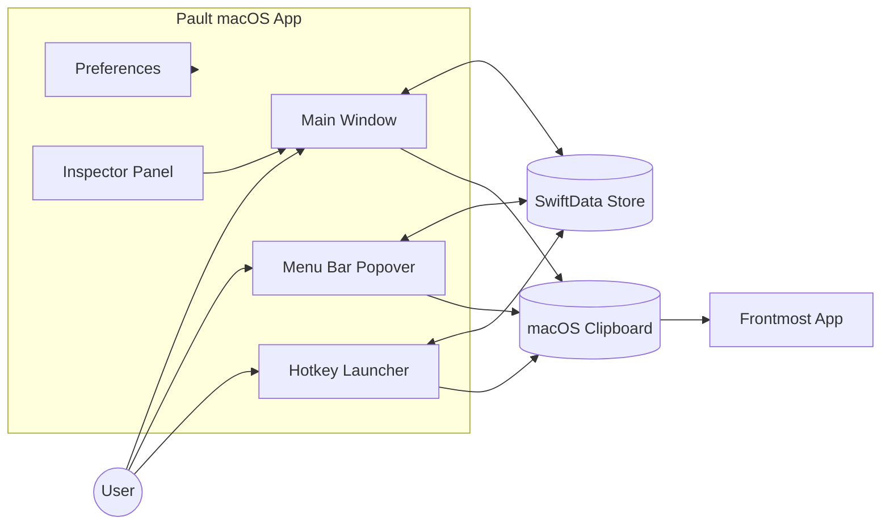

# Architecture

## Overview
Pault is a macOS SwiftUI app backed by SwiftData. It exposes three primary surfaces that all read/write the same local store: the main window, a menu bar popover, and a global hotkey launcher.

## Core surfaces
- **Main window** (`ContentView`): sidebar filters, search, and prompt editing with the inspector panel.
- **Menu bar popover** (`MenuBarContentView`): quick list with copy/paste actions and lightweight prompt creation.
- **Hotkey launcher** (`HotkeyLauncherView`): global search and actions opened with ⌘⇧P.
- **Preferences** (`PreferencesView`): login item, dock visibility, and launcher defaults.
- **Onboarding** (`OnboardingView`): first-run walkthrough shown from `ContentView` when `hasCompletedOnboarding` is false.

## Data layer
- SwiftData `ModelContainer` is created in `PaultApp` with `Prompt`, `Tag`, and `TemplateVariable`.
- If the persistent store fails to load, the app falls back to an in-memory store.
- `PromptService` is the operation layer used by all three surfaces for CRUD, filtering, copy/paste, and tag mutations.

## Key flows
- **Editing**: title/content edits are debounced in `PromptDetailView` before saving.
- **Template variables**: `TemplateEngine` scans prompt content for `{{variable}}`, syncs `TemplateVariable` rows, and resolves copied/pasted output with filled values.
- **Tags**: managed via the inspector panel with color selection and in-place creation.
- **Filtering**: sidebar supports all, recent, archived, and tag filters; search runs across title, content, and tags.
- **Launcher**: hotkey opens a floating panel; copy/paste actions write to the clipboard and optionally simulate paste.

## Supporting components
- **`SidebarView`**: sidebar filters, search field, prompt list with context menus and empty states.
- **`InspectorView`**: tag management, favorite toggle, dates, and archive controls.
- **`TemplateVariablesView`**: editable fields and resolved preview for variables parsed from prompt content.
- **`TagPillView` / `TagPillsView`**: reusable tag pill components with `TagColors` enum for color mapping.
- **`CopyToast`**: floating toast notification confirming clipboard copy actions.
- **`AccessibilityHelper`**: centralized Accessibility permission checking and `CGEvent` paste simulation.
- **`FlowLayout`**: custom SwiftUI `Layout` for wrapping tag pills.

## Platform-specific behavior
- Global hotkey registration uses Carbon (`GlobalHotkeyManager`).
- Clipboard access uses `NSPasteboard`.
- Paste simulation uses `CGEvent` via `AccessibilityHelper` and requires macOS Accessibility permission (prompted automatically on first use).

## PaultCore note
`PaultCore` is a separate Swift package containing expanded models (workflows, variables, usage logs) that is not currently integrated with the macOS app target.

## System overview diagram
Mermaid source and PNG export live in `docs/diagrams/`.

PNG export target: `docs/diagrams/exports/system-overview.png` (generated via `scripts/render_mermaid.py`)
