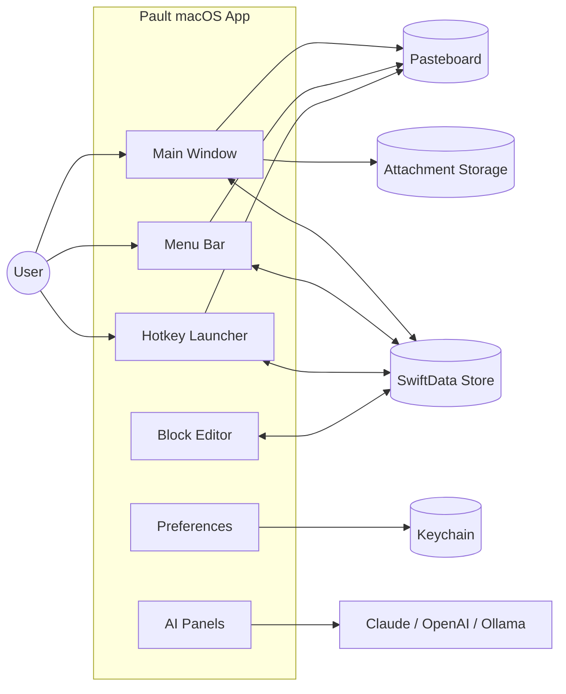

# Architecture

## Overview
Pault is a macOS SwiftUI app backed by SwiftData. It has three user-facing access points into one local data store:
- Main window for full prompt management.
- Menu bar popover for quick access and lightweight creation.
- Global launcher for keyboard-first search and copy.

The current app is no longer just a plain text prompt list. The main window includes a launchpad, a text editor with variables and attachments, a visual block editor, version history, Pro analytics, and provider-backed AI tooling.

## Core surfaces
- `ContentView`: main window shell with collapsible sidebar and inspector.
- `PromptLaunchpadView`: new-prompt entry point for blank, template, clipboard, and AI-assisted creation.
- `PromptDetailView`: title editing, text editing, block-mode switching, AI assist, response streaming, A/B testing, and template saving.
- `BlockEditorView`: visual prompt composition with block library, canvas, compiled preview, and save-to-prompt flow.
- `MenuBarContentView`: search, quick copy, favorite/archive/delete, and simple prompt creation.
- `HotkeyLauncherView`: search and copy workflow driven by the global hotkey.
- `PreferencesView`: general settings, hotkey configuration, appearance, data import/export, and AI provider settings.

## Data layer
- `PaultApp` creates one `ModelContainer` for `Prompt`, `Tag`, `TemplateVariable`, `Attachment`, `PromptRun`, `CopyEvent`, `PromptVersion`, `SmartCollection`, `PromptTemplate`, and `CustomBlock`.
- If the persistent store fails to load, the app falls back to an in-memory store.
- `PromptService` handles CRUD, filtering, copying, tagging, and version snapshot creation.
- The block editor stores its canvas state as serialized snapshot data on `Prompt` rather than as a separate graph of SwiftData block entities.

## Key flows
- Prompt creation starts from the launchpad in the main window or a simpler sheet in the menu bar.
- Text editing debounces saves and template-variable sync.
- Block editing compiles canvas state back into `Prompt.content` and stores a block composition snapshot on save.
- Version history is saved through `PromptService.saveSnapshot(...)` and surfaced from the inspector.
- Copy actions resolve template variables, write plain text to the pasteboard, optionally write rich content, and log `CopyEvent` usage.
- AI actions call provider APIs through `AIService` using user-supplied credentials stored in Keychain.
- Prompt runs stream output into `ResponsePanel` and persist `PromptRun` records.

## Supporting components
- `SidebarView`: search, recent/all/archived filters, and Pro smart collections.
- `InspectorView`: tags, favorite state, basic details, Pro stats, and version history.
- `TemplateVariablesView`: variable input and resolved preview.
- `AttachmentsStripView` / `AttachmentManager`: attachment add/open/delete behavior and storage management.
- `AnalyticsView` / `AnalyticsService`: usage ranking from `CopyEvent` and `PromptRun`.
- `AIAssistPanel`: improve, variable suggestion, tag suggestion, quality score, and refinement workflows.
- `TemplateSeedService`: first-run seeding of built-in prompt templates.

## Platform-specific behavior
- Global hotkey registration uses Carbon through `GlobalHotkeyManager`.
- Clipboard writes use `NSPasteboard`.
- Import and export use `NSOpenPanel` and `NSSavePanel`.
- Large attachment references use security-scoped bookmarks; smaller attachments are copied into Application Support.

## System overview

```mermaid
flowchart LR
    User((User))

    subgraph App["Pault macOS App"]
        Main["Main Window"]
        Menu["Menu Bar"]
        Launch["Hotkey Launcher"]
        Prefs["Preferences"]
        Blocks["Block Editor"]
        AI["AI Panels"]
    end

    Store[("SwiftData Store")]
    Keychain[("Keychain")]
    Clipboard[("Pasteboard")]
    Files[("Attachment Storage")]
    Providers["Claude / OpenAI / Ollama"]

    User --> Main
    User --> Menu
    User --> Launch

    Main <--> Store
    Menu <--> Store
    Launch <--> Store
    Blocks <--> Store

    Main --> Clipboard
    Menu --> Clipboard
    Launch --> Clipboard

    Main --> Files
    Prefs --> Keychain
    AI --> Providers
```
